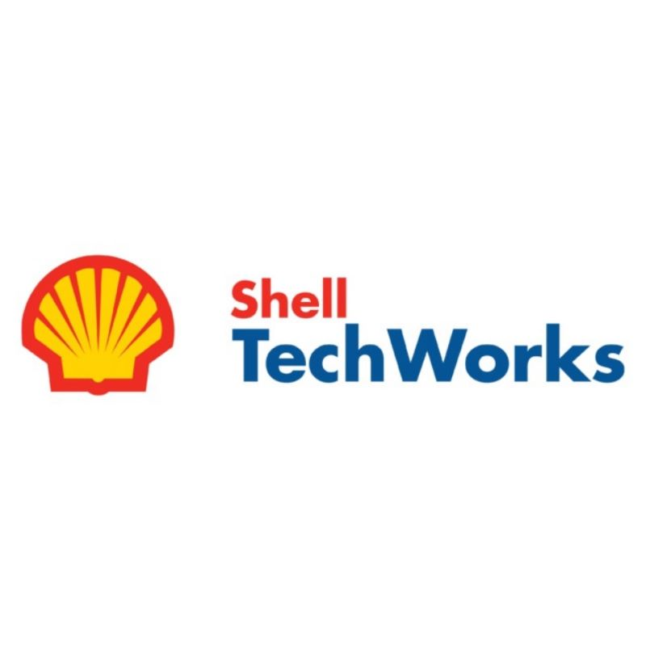
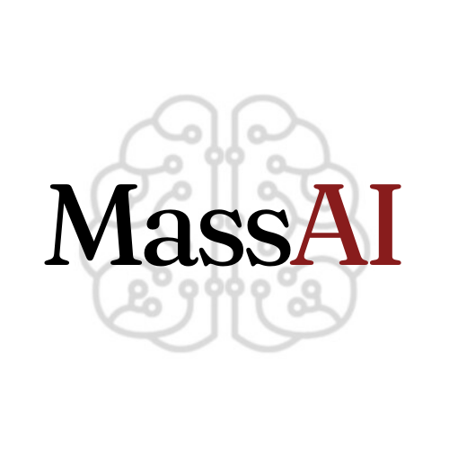

## Experience

My most relevant non-research experience
- 

  

    <b>Shell TechWorks</b>
      
    <b>Software Engineer Intern</b>
      
    <i>Summers 2024, 2025</i>
      
    Investigated the ways LLMs could be use for real-world business cases at TechWorks, including querying databases with natural language, complex document evaluation, and how/when to fine-tune LLMs for the best results and lowest cost. Also assisted with software engineering tasks, including participating in 2 weeklong TechWorks hackathons, and refactored a suite of old web/mobile applications totalling 100,000 lines of code.
  

  
   
  

 
- 

  

    <b>MassAI</b>
      
    <b>Events Coordinator</b>
      
    <i>September 2023-Present</i>
      
    In charge of event planning, support, and general e-board tasks. Developed software tool to enable reinforcement learning competitions. Led team of first-year students through their first semester-long ML project, including consulting research literature to guide methodology.
  

  
  

